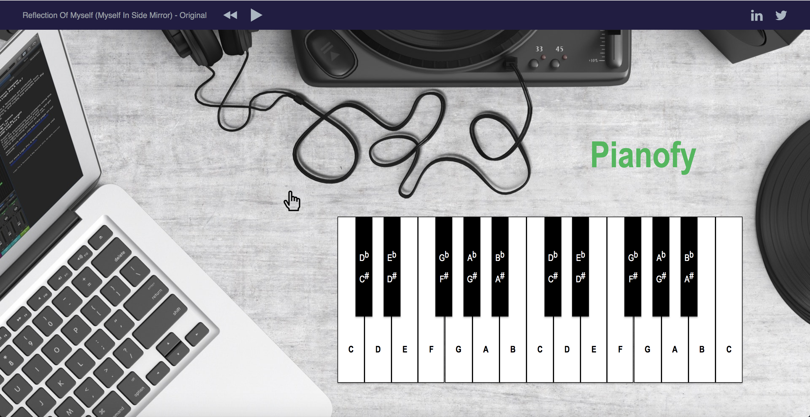

# Pianofy

A virtual piano on the web to increase access to the piano for people anywhere anytime

It is built in Web Audio API, Web APIs, CSS, HTML and jQuery.

## Instructions

1. Clone this repo using `git clone https://github.com/Monthly-Music-Hackathon-NYC/pianofy.git`.
2. Move to the root directory: `cd pianofy`.
3. Open `index.html` under the root directory using a local server of your choice. If you're using **Visual Studio Code**, you can find and install the `Live Server` extension within VSC itself using the Extensions panel (⌘⇧X or the square icon in the left sidebar).
4. See the application at `http://127.0.0.1:5500` (See **Notice** below).

### Notice

The piano is not rendered in the browser when the page is loaded because there's a CORS (Cross-Origin Resource Sharing) issue when `http://127.0.0.1:5500` tries to request the piano samples from `https://play-pianofy.herokuapp.com`. `https://play-pianofy.herokuapp.com` has not indicated that `http://127.0.0.1:5500` is allowed to access this page. The browser will trigger the `XMLHttpRequest`'s `error` event and deny the piano samples to the requesting `http://127.0.0.1:5500`.

I'm working on the CORS issue by setting the response header `Access-Control-Allow-Origin: http://127.0.0.1:5500` on `https://play-pianofy.herokuapp.com`.

## UI

## Demo
Click on [this link](https://play-pianofy.herokuapp.com/) to see the demo.
